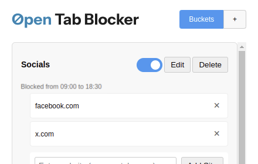

# 

[](https://chrome.google.com/webstore/detail/open-tab-blocker/WIP)

Open Tab Blocker is a Chrome extension designed to help you manage your browsing habits by grouping tabs into buckets and restricting access to certain sites based on predefined rules. This extension helps improve your productivity by limiting distractions and promoting focused browsing.

Initially developed as a test using GitHub Copilot, the extension is fully functional, open source and available for download on the Chrome Web Store.

## Features

- Group tabs into customizable buckets.
- Set rules to restrict access to specific sites during certain times.
- Block access to restricted sites altogether.
- Easily switch on/off tab buckets of sites.



## Installation

### From Chrome Web Store

1. Visit the [Open Tab Blocker Chrome Web Store page](https://chrome.google.com/webstore/detail/open-tab-blocker/WIP).
2. Click "Add to Chrome" to install the extension.

### Developer Installation

1. Clone the repository:
    ```bash
    git clone https://github.com/stilliard/open-tab-blocker.git
    ```
2. Open Chrome and navigate to `chrome://extensions/`.
3. Enable "Developer mode" by toggling the switch in the top right corner.
4. Click on "Load unpacked" and select the cloned repository folder.

## Usage

1. Click on the Open Tab Blocker icon in the Chrome toolbar.
2. Create and customize your tab buckets.
3. Set rules to restrict access to specific sites during certain times.
4. Browse as usual. The extension will block access to restricted sites.

## Contributing

Contributions are welcome! Please fork the repository and submit a pull request for any improvements or bug fixes.

### Building the extension for Chrome Web Store

1. Install dependencies:
    ```bash
    npm install
    ```
2. Build the extension:
    ```bash
    npm run build
    ```
3. The built extension zip file will be located in the `web-ext-artifacts` folder which you can then upload to the Chrome Web Store.

## License

This project is licensed under the MIT License. See the [LICENSE](LICENSE) file for details.
